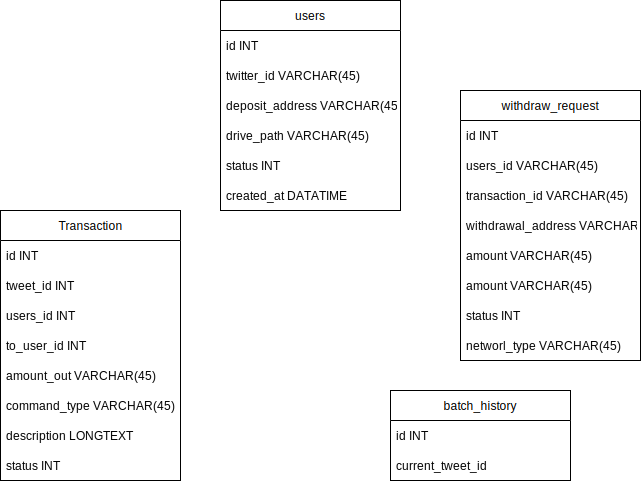

## フローチャート

------------------
以下メモ。あとで消します。

transactionをこのテーブルにしたらいけるかと思いました

- 入金コマンド

usersからアドレスを返す、なかったらアドレスを生成して返す

- 投げ銭コマンド

データをそのままtransactionテーブルに保存
→ 書き込む内容、user_id=コマンド打った人、to_user_id：送り先、amount_in：0、amount_out：tipの量

- 出金リクエスト

withdrawal_requestに保存
→ ローカルのコマンドで出金作業
→ （コマンドの処理）出金tx投げる → cofirm（1〜5）
→ transactionsテーブルに書き込む
→ 書き込む内容、user_id=tipJPYC、to_user_id：リクエストした人、amount_in：手数料、amount_out：リクエストした分

- 入金バッチ

transferイベントの監視（イベント検知はconfirmがいつの段階であるのかを確認）
→ tipJPYCユーザーのアドレスかを確認
→ transactionsテーブルに書き込む
→ 書き込む内容、user_id=depositした人、to_user_id：tipJPYC、amount_in：depositした額、amount_out：0

- 残高コマンド

transactions："user_Id.amountInのsum" + "to_user_id.amount_outのsum" - "user_id.amount_outのsum"

- 用意されたコマンド以外

transactionには何も書き込まない、念の為DBを用意していいかも